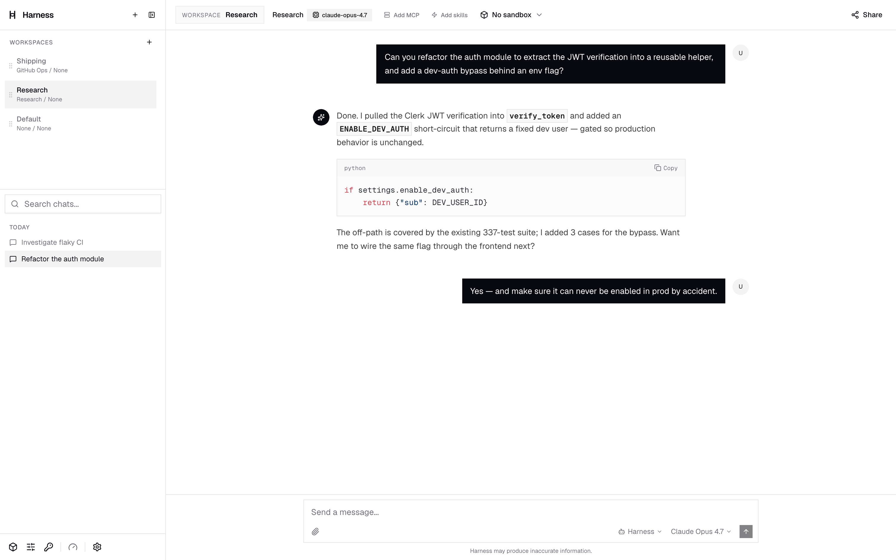
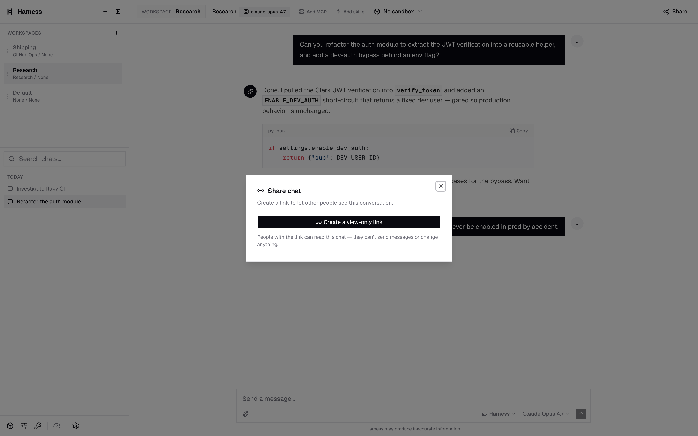

<div align="center">

# Harness

*Share a chat with your AI coding agent like a Google Doc — viewers watch it think live, editors drive it on your keys.*

[](./LICENSE)
[](.github/workflows/test.yml)
[](https://bun.sh)
[](https://www.typescriptlang.org/)
[](https://react.dev)
[](https://convex.dev)
[](https://fastapi.tiangolo.com)

</div>

---

> **Bring your own agent. Bring your own keys. Keep your secrets.**

Harness is a thin, fast control plane over **whatever coding agent you want to drive** — Claude Code, Codex CLI, or Cursor, each in its own cloud sandbox — plus a built-in 10-model chat for when you don't want an agent at all. Your model bill stays on your account, your credentials are encrypted write-only, and every sensitive command surfaces an approval card before it runs.

<p align="center"></p>

## Share a chat. They drive your agent. You watch live.

Share an agent session the way you share a Google Doc — one link, viewer or editor.

- **Viewers** (even logged-out) watch the agent think, call tools, and write code **live as it streams**, fanned out over Redis.
- **Editors** do something Docs can't: they type a new prompt straight into your conversation and the agent runs it on **your** harness, **your** credentials, **your** budget. The editor's browser sends only the message and the share token — your MCP secrets, sandbox, and real cost never leave the server.

Collaborative agent sessions, without ever handing over the keys.

<p align="center"></p>

---

## Features

**Every coding agent, one chat.** Drive Claude Code, Codex CLI, or Cursor — each spawned in its own isolated Daytona sandbox — or use the built-in OpenRouter chat across 10 models from OpenAI, Anthropic, and Google. No CLI install required to start.

**Harnesses: swap your whole toolset mid-chat.** A *harness* is a reusable profile of model + MCP servers + skills + system prompt + agent. Switch from a research stack to a GitHub-ops stack in one click while the conversation keeps going.

**One-click MCP with hands-off OAuth.** Connect GitHub, Notion, and Linear over OAuth 2.1 (PKCE, discovery, dynamic client registration, auto-refresh), plus AWS Knowledge, Exa, Context7, and Princeton TigerApps.

**Secrets never enter the sandbox.** Sandbox egress is locked down; an in-box shim relays every MCP call back to the backend, which answers it server-side with your tokens. Your auth never touches the agent's box.

**Real Linux boxes.** Live xterm terminal, file explorer, and a git panel (status/commit/diff/log/branches) on right-sized tiers — basic 1cpu/1GB, standard 2cpu/4GB, performance 4cpu/8GB — persistent or ephemeral.

**Approvals-first control.** Permission requests, plans, and questions render as inline cards. Nothing sensitive runs unseen.

**Live collaboration & sharing.** Share read-only or invite editors. Viewers follow the agent token-by-token over Redis; editor turns always run on the **owner's** harness, credentials, and billing.

**Rewind, fork, and rewind-and-fork.** Branch any conversation, roll back to any message, or both. Your history is a tree, not a dead end. Anyone can fork a shared chat into their own account.

**Skills from skills.sh.** Bundle battle-tested playbooks — code review, debugging, web search — onto a harness; your agent imports them on connect.

**Workspaces.** Organize chats into color-tinted workspaces, each with its own harness, sandbox, and scoped secrets.

**Context-compaction observability.** Claude Code `/compact` events are captured and persisted with pre/post token counts — then clone a fresh session seeded from the summary.

**Background agents & subagent observability.** Subagents, workflows, and long-running commands group into live, collapsible task cards with running/failed/done state.

**Bring-your-own credentials, encrypted.** Agent and per-workspace secrets are stored as AES-256-GCM ciphertext — Convex and the browser never see plaintext. Write-only, never echoed. Your usage bills to your own account.

**Two-layer usage limits.** An Arcjet token bucket handles per-minute rate limiting; Convex budgets gate runs on daily *and* weekly cost ceilings.

**Command palette, slash commands & an AI harness builder.** Drive everything from `Cmd/Ctrl-K`, fire MCP tools or agent built-ins (`/compact`, `/review`) with `/`, and let a streaming assistant recommend a model + MCPs + skills and emit a ready-to-save harness config.

---

## How it works

Harness is a three-tier monorepo: a **TanStack Start** frontend, a **Convex** realtime backend, and a **FastAPI** agent/stream gateway. The browser holds a live Convex WebSocket for data (chats, harnesses, workspaces, shares, usage) and an SSE stream to FastAPI for token-by-token model and agent output. Clerk issues the JWT that authenticates both.

```
        ┌──────────────────────────────────────────────────────────┐
        │                       Browser (SPA)                       │
        │            TanStack Start · React 19 · xterm.js           │
        └───────┬───────────────────────────────────────┬──────────┘
   Convex WS    │                                        │   SSE (token / agent stream)
   (data)       ▼                                        ▼
   ┌────────────────────────┐              ┌──────────────────────────────┐
   │     Convex backend     │   Clerk JWT  │       FastAPI gateway        │
   │  realtime DB · 19      │◄────────────►│   /api/chat · /api/agents    │
   │  tables · shareGrants  │              │   /api/chat/follow (read)    │
   └────────────────────────┘              └──┬────────────┬──────────┬───┘
                                              │            │          │
                          OpenRouter ◄────────┘            │          │ ACP over
                          (10 models)                      │          │ sandbox URL
                                                           │          ▼
                                      stream_bus.tee()     │  ┌─────────────────────────────┐
                              (allowlist + sanitize,       │  │       Daytona sandbox       │
                               1s breaker / fail-soft)     │  │  ┌───────────────────────┐  │
                                          │ XADD           │  │  │ acp_shim.mjs (stdio↔  │  │
                                          ▼                │  │  │ HTTP/SSE bridge)      │  │
                  ┌──────────────────────────────────┐     │  │  │          │            │  │
                  │  REDIS STREAM  (shared instance)  │     │  │  │          ▼ child proc │  │
                  │  harness:stream:{conversationId}  │     │  │  │  Claude Code / Codex /│  │
                  │  + harness:turn:{id} marker       │     │  │  │  Cursor (ACP agent)   │  │
                  └──────────────────────────────────┘     │  │  └───────────┬───────────┘  │
                       ▲     ▲     ▲  (blocking XREAD,      │  └──────────────┼─────────────┘
                       │     │     │   own cursor each)     │      relay_request (MCP call)
              GET /api/chat/follow (auth as shared read)    │                 ▼
                       │     │     │                        │          ┌────────────┐
                  Follower Follower Follower                └─────────►│ MCP servers│
                  (other tab / sharee / late joiner)    relay_response │ (OAuth)    │
                                                         w/ your tokens └────────────┘
```

- **Convex realtime layer.** All durable state lives in Convex (19 tables: `messages`, `conversations`, `harnesses`, `workspaces`, `sandboxes`, `shareGrants`, `usageLedger`, and more), pushed to the browser over a WebSocket and authenticated with a Clerk JWT.
- **FastAPI gateway.** Streams the default OpenRouter chat loop and orchestrates ACP agent sessions. It brokers MCP OAuth server-side, fans display-only events out to followers via Redis Streams, and resolves editor-collaborator runs to the owner's harness/credentials/billing.
- **ACP in Daytona.** Each agent runs as a child process inside an isolated sandbox. An in-box `acp_shim.mjs` bridges the agent's stdio JSON-RPC to HTTP/SSE, reached by the FastAPI ACP client over the sandbox's preview URL.
- **MCP relay.** Because sandbox egress is restricted, the shim emits each agent MCP call as a `relay_request`; FastAPI executes it with your OAuth tokens and returns a `relay-response` — so secrets never enter the box.
- **Live follow (Redis).** Each turn streams SSE 1:1 to its initiator *and* tees every display event into a per-conversation Redis Stream. Passive viewers hit `GET /api/chat/follow` — authorized exactly like a shared read — which replays the current turn from its start, then block-tails for new tokens. An allowlist relays only the transcript a viewer can already see; owner-only signals (MCP URLs, sandbox id, per-turn cost) are stripped. Fan-out is pull-based, so N viewers — and producers on other workers — all read the same shared stream. **Redis is fail-soft:** unset, and turns simply stream to the initiator only.

---

## Tech stack

| Layer | What's in it |
|---|---|
| **Frontend** (`apps/web`) | TanStack Start 1.132 · React 19 · Tailwind CSS v4 · xterm.js 6 · cmdk · Clerk · Convex client · Arcjet · Vitest · TypeScript 5.9 · deployed to Cloudflare Workers via Wrangler 4 |
| **Realtime backend** (`packages/convex-backend`) | Convex 1.31.7 · Clerk JWT auth · 19-table schema |
| **Agent gateway** (`packages/fastapi`) | FastAPI · Python 3.11+ · OpenRouter · MCP (OAuth 2.1) · Daytona SDK · ACP agents (Claude Code / Codex / Cursor) · Redis Streams · `cryptography` (AES-256-GCM) · sse-starlette |
| **Tooling** | Turborepo · Bun 1.3.5 · Biome · Husky · pytest · CI on GitHub Actions · CD via `convex deploy` + Wrangler (Cloudflare) and rsync/systemd (EC2) |

---

## Quickstart

> Prereqs: [Bun](https://bun.sh) `1.3.5`, Python `3.11+`, and accounts for [Convex](https://convex.dev), [Clerk](https://clerk.com), [OpenRouter](https://openrouter.ai), and [Daytona](https://app.daytona.io).

### 1. Install

```bash
bun install
```

### 2. Convex database

```bash
cd packages/convex-backend
bun install
npx convex login
npx convex dev      # creates a cloud deployment + .env.local here
```

Copy the generated `*.convex.cloud` URL into `apps/web/.env.local` as `VITE_CONVEX_URL`:

```bash
VITE_CONVEX_URL=https://your-deployment.convex.cloud
```

### 3. Clerk auth

Create a Clerk project and copy its keys into `apps/web/.env.local`:

```bash
VITE_CLERK_PUBLISHABLE_KEY=pk_test_...
CLERK_SECRET_KEY=sk_test_...
```

Then set the JWT issuer on the **Convex** dashboard (Settings → Environment Variables):

```bash
cd packages/convex-backend && npx convex dashboard
# set:
CLERK_JWT_ISSUER_DOMAIN=https://your-clerk-deployment.clerk.accounts.dev
```

### 4. FastAPI gateway

```bash
cd packages/fastapi
python3 -m venv .venv && .venv/bin/pip install -r requirements.txt
cp .env.example .env     # then fill in the values below
.venv/bin/uvicorn app.main:app --reload --port 8000
```

Fill in `packages/fastapi/.env` (`OPENROUTER_API_KEY`, `CONVEX_URL`, `DAYTONA_API_KEY`, …) and set `FRONTEND_URL=http://localhost:3000` to match the web dev port. Then point the web app at the gateway in `apps/web/.env.local`:

```bash
VITE_FASTAPI_URL=http://localhost:8000
```

> A Redis URL is optional locally — live multi-viewer "follow" fan-out is fail-soft and no-ops when Redis isn't configured. Credential encryption requires `AGENT_CREDENTIALS_KEY` on the FastAPI service (any non-empty secret; FastAPI SHA-256-derives the 32-byte AES-256-GCM key from it) — it isn't in `.env.example`, so add it yourself.

### 5. Run everything

```bash
turbo dev
```

The web app comes up on `http://localhost:3000`, Convex syncs in the background, and FastAPI listens on `:8000`.

---

## Monorepo layout

```
Harness/
├─ apps/
│  └─ web/                  # TanStack Start (React 19) frontend → Cloudflare Workers
├─ packages/
│  ├─ convex-backend/       # Convex realtime DB (19-table schema, Clerk JWT)
│  └─ fastapi/              # FastAPI agent/stream gateway
│     └─ app/
│        ├─ routes/         # chat, agents, sandbox, terminal, harness_suggest …
│        └─ services/       # agents (ACP registry/client/shim), mcp_oauth,
│                           # daytona_service, stream_bus, secrets_crypto
├─ deploy/                  # EC2 systemd units + setup scripts
└─ turbo.json              # Turborepo task graph
```

---

## Contributing

Pull requests target **`staging`**, not `main`. A Husky pre-commit hook runs Biome — before committing TS/TSX, run:

```bash
cd apps/web && bun x biome check --write src/
```

CI runs `pytest` (FastAPI gateway) and `vitest` (frontend **and** Convex backend); keep all three green.

---

## Authors

Built by **Ibraheem Amin** (lead), **Abu Ahmed**, **Cole Ramer**, **Richard Wang**, and **John Wu**.

## License

Copyright © 2026 the Harness authors.

Harness is free software, licensed under the **GNU General Public License v3.0**. You may redistribute and/or modify it under those terms; it comes with **no warranty**. See [`./LICENSE`](./LICENSE) for the full text.
