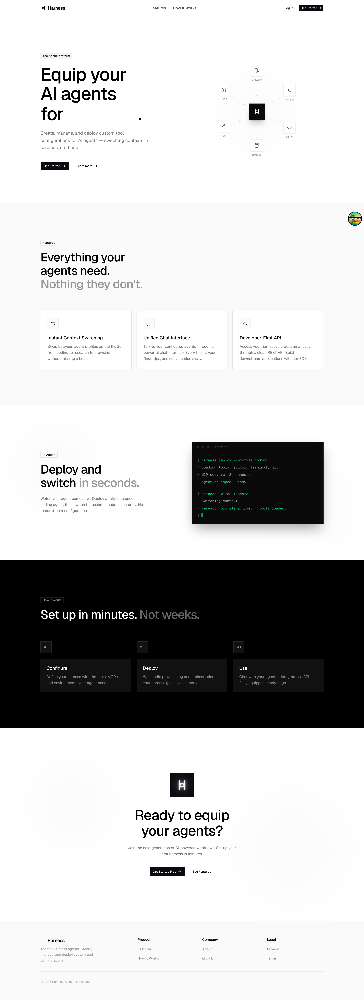

<div align="center">

# Harness

*Turn any coding agent into a chat — Claude Code, Codex, or Cursor, each in its own cloud sandbox, one polished interface.*

[](./LICENSE)
[](.github/workflows/test.yml)
[](https://bun.sh)
[](https://www.typescriptlang.org/)
[](https://react.dev)
[](https://convex.dev)
[](https://fastapi.tiangolo.com)

</div>

---

> **Bring your own agent. Bring your own keys. Keep your secrets.**
> Harness drops Claude Code, Codex CLI, and Cursor into isolated cloud sandboxes, hands them your MCP tools without ever leaking your tokens, and wraps the whole thing in one chat you can fork, share, and rewind.

Most agent UIs lock you into one model or one CLI. Harness is the opposite: it's a thin, fast control plane over **whatever agent you want to drive** — plus a built-in 10-model chat for when you don't want an agent at all. Your model bill stays on your own account, your credentials are encrypted write-only, and every sensitive command surfaces an approval card before it runs.

<details>
<summary><b>📸 Product preview</b></summary>

<p align="center"></p>

</details>

---

## Features

**🔌 Every coding agent, one chat.** Three live ACP agents ship with concrete launch specs — Codex CLI (`zed-industries/codex-acp` v0.16.0), Claude Code (`@agentclientprotocol/claude-agent-acp` v0.44.0), and Cursor (`cursor-agent --force acp`) — each spawned as a child process inside its own Daytona sandbox. *(`packages/fastapi/app/services/agents/registry.py:19-107`)*

**💬 Built-in multi-model chat, no agent required.** A default loop streams through OpenRouter across 10 model options from OpenAI, Anthropic, and Google (including "thinking" variants) — start instantly, no CLI install. *(`packages/fastapi/app/config.py:91-124`, `apps/web/src/lib/models.ts:11-53`)*

**🔁 Rapid MCP context switching.** A *harness* is a reusable profile of model + MCP servers + skills + system prompt + agent. Swap your agent's entire toolset mid-conversation — research stack to GitHub-ops stack in one click — while the chat keeps going. *(`packages/convex-backend/convex/schema.ts:5-65`, `packages/fastapi/app/routes/agents.py`)*

**🛡️ MCP catalog with hands-off OAuth.** One-click connect GitHub, Notion, and Linear (OAuth 2.1 — PKCE S256, RFC 9728/8414 discovery, RFC 7591 dynamic client registration as fallback, auto-refresh), plus AWS Knowledge, Exa, Context7, and Princeton's TigerApps. *(`apps/web/src/lib/mcp.ts:30-186`, `packages/fastapi/app/services/mcp_oauth.py`)*

**🔒 The MCP relay keeps tokens out of the sandbox.** Daytona sandboxes have restricted egress, so an in-sandbox shim emits each agent MCP call as a `relay_request` SSE event and the FastAPI backend answers it server-side — your auth tokens never enter the box. *(`packages/fastapi/app/services/agents/acp_shim.mjs:13-21`, `acp_client.py`)*

**🖥️ Real Linux boxes: terminal, files, and git.** Resource tiers map to real specs — basic 1cpu/1GB/3GB, standard 2/4/8, performance 4/8/10 — each with a live xterm terminal over WebSocket, a file explorer, and a git panel (status/add/commit/diff/log/branches), persistent or ephemeral. *(`packages/fastapi/app/services/daytona_service.py:83-94`, `packages/fastapi/app/routes/sandbox.py`)*

**✅ Approvals-first agent control.** The prompt stream emits `permission_request`, `plan`, and `question` events rendered as inline cards, each with a dedicated endpoint to answer — nothing sensitive runs unseen. *(emitted in `packages/fastapi/app/services/agents/session_manager.py:615,2313`; answered at `app/routes/agents.py:695-729`; `apps/web/src/components/agent-permission-card.tsx`)*

**📚 Skills from skills.sh.** Bundle battle-tested playbooks — code review, debugging, web search — onto a harness; your agent imports them on connect via a `get_skill_content` tool and a generated skills system block. *(`packages/fastapi/app/routes/chat.py:68-264`, `packages/convex-backend/convex/skills.ts`)*

**🗂️ Workspaces.** Organize chats into color-tinted workspaces, each with its own harness, sandbox, ordering, and scoped secrets — with exactly one undeletable default. *(`packages/convex-backend/convex/schema.ts:114-132`, `convex/workspaces.ts`)*

**👥 Chat sharing with roles + live follow.** Share read-only or invite editors who can send messages into the chat, with public links backed by a 32-byte client-generated token. Passive viewers watch the agent think in real time via per-conversation Redis Streams; editors always run under the **owner's** harness, credentials, and billing. *(`packages/convex-backend/convex/shares.ts`, `packages/fastapi/app/services/stream_bus.py`)*

**🌿 Rewind, fork, and rewind-and-fork.** Branch any conversation, roll back to any message, or do both — your history is a tree, not a dead end. Conversations track fork and edit parents with message-count anchors. *(`packages/convex-backend/convex/conversations.ts:304-528`, `apps/web/src/components/message-actions.tsx`)*

**🧠 Context-compaction observability.** Claude Code `/compact` events (manual or auto) are captured from the ACP stream and persisted append-only with pre/post token counts — then you can clone a fresh session seeded from the summary. *(`packages/convex-backend/convex/schema.ts:177-192`, `convex/compactions.ts`)*

**🔭 Background agents & subagent observability.** Subagents, workflows, and long-running commands group into live, collapsible task cards with running/failed/done state and an active-count badge. *(`apps/web/src/components/chat/background-agents-panel.tsx`)*

**🔐 Bring-your-own credentials, encrypted.** Agent and per-workspace secrets are stored as AES-256-GCM ciphertext (key held only in FastAPI) — Convex and the browser never see plaintext, and credentials are write-only/never echoed. Your agent usage bills to your own account. *(`packages/fastapi/app/services/secrets_crypto.py:22-47`, `packages/convex-backend/convex/schema.ts:271-312`)*

**📊 Two-layer usage limits.** An Arcjet token bucket (refill 20/min, capacity 30, keyed on userId) handles per-minute rate limiting; Convex usage budgets gate runs on daily *and* weekly cost ceilings. *(`apps/web/src/lib/arcjet.ts:29-37`, `packages/convex-backend/convex/usage.ts:14-65`)*

**⌘ Command palette, slash commands & an AI harness builder.** Drive everything from `Cmd/Ctrl-K`, fire MCP tools or agent built-ins (`/compact`, `/review`) with `/`, and let a streaming assistant recommend a model + MCPs + skills and emit a ready-to-save harness config. *(`apps/web/src/components/command-palette/command-palette.tsx`, `apps/web/src/components/slash-commands.tsx`, `packages/fastapi/app/routes/harness_suggest.py`)*

---

## How it works

Harness is a three-tier monorepo: a **TanStack Start** frontend, a **Convex** realtime backend, and a **FastAPI** agent/stream gateway. The browser holds a live Convex WebSocket for data (chats, harnesses, workspaces, shares, usage) and an SSE stream to FastAPI for token-by-token model and agent output. Clerk issues the JWT that authenticates both.

```
                                  ┌────────────────────────────────────────┐
                                  │              Browser (SPA)              │
                                  │   TanStack Start · React 19 · xterm.js  │
                                  └──────┬──────────────────────────┬───────┘
                      Convex WS (data)   │                          │  SSE (token/agent stream)
                                         ▼                          ▼
                         ┌───────────────────────┐      ┌───────────────────────────┐
                         │   Convex backend      │      │     FastAPI gateway       │
                         │  realtime DB · 19      │      │  /api/chat · /api/agents  │
                         │  tables · Clerk JWT    │◄────►│  Clerk JWT · Redis follow │
                         └───────────────────────┘      └─────┬───────────────┬─────┘
                                                              │               │
                                              OpenRouter      │               │  ACP over sandbox preview URL
                                              (10 models)  ◄──┘               ▼
                                                              ┌───────────────────────────────┐
                                                              │      Daytona sandbox          │
                                                              │  ┌─────────────────────────┐  │
                                                  relay_resp  │  │  acp_shim.mjs (stdio↔   │  │
                              ┌───────────────────◄───────────┼──┤  HTTP/SSE bridge)       │  │
                              │  MCP w/ OAuth tokens          │  │      │                  │  │
                         ┌────▼─────┐  relay_request          │  │      ▼ child process     │  │
                         │   MCP    │────────────────────────►│  │  Claude Code / Codex /  │  │
                         │ servers  │                         │  │  Cursor (ACP agent)     │  │
                         └──────────┘                         │  └─────────────────────────┘  │
                                                              └───────────────────────────────┘
```

- **Convex realtime layer.** All durable state lives in Convex (19 tables: `messages`, `conversations`, `harnesses`, `workspaces`, `sandboxes`, `shareGrants`, `usageLedger`, and more — `packages/convex-backend/convex/schema.ts`), pushed to the browser over a WebSocket and authenticated with a Clerk-issued JWT.
- **FastAPI gateway.** Streams the default OpenRouter chat loop and orchestrates ACP agent sessions. It brokers MCP OAuth server-side, fans display-only events out to followers via Redis Streams, and resolves editor-collaborator runs to the owner's harness/credentials/billing.
- **ACP in Daytona.** Each agent runs as a child process inside an isolated Daytona sandbox. An in-sandbox `acp_shim.mjs` bridges the agent's stdio JSON-RPC to HTTP/SSE, which the FastAPI ACP client reaches over the sandbox's preview URL.
- **MCP relay.** Because sandbox egress is restricted, the shim surfaces `/mcp/<n>` endpoints and emits each agent MCP call as a `relay_request`; FastAPI executes it with your OAuth tokens and returns the result via `relay-response` — so secrets never enter the sandbox.

---

## Tech stack

| Layer | What's in it |
|---|---|
| **Frontend** (`apps/web`) | TanStack Start 1.132 · React 19 · Tailwind CSS v4 · xterm.js 6 · cmdk · Clerk · Convex client · Arcjet · Vitest · TypeScript 5.9 · deployed to Cloudflare Workers via Wrangler 4 |
| **Realtime backend** (`packages/convex-backend`) | Convex 1.31.7 · Clerk JWT auth · 19-table schema |
| **Agent gateway** (`packages/fastapi`) | FastAPI · Python 3.11+ · OpenRouter · MCP (OAuth 2.1) · Daytona SDK · ACP agents (Claude Code / Codex / Cursor) · Redis Streams · `cryptography` (AES-256-GCM) · sse-starlette |
| **Tooling** | Turborepo · Bun 1.3.5 · Biome · Husky · pytest · CI on GitHub Actions · CD via `convex deploy` + Wrangler (Cloudflare) and rsync/systemd (EC2) |

---

## Quickstart

> Prereqs: [Bun](https://bun.sh) `1.3.5`, Python `3.11+`, and accounts for [Convex](https://convex.dev), [Clerk](https://clerk.com), [OpenRouter](https://openrouter.ai), and [Daytona](https://app.daytona.io).

### 1. Install

```bash
bun install
```

### 2. Convex database

```bash
cd packages/convex-backend
bun install
npx convex login
npx convex dev      # creates a cloud deployment + .env.local here
```

Copy the generated `*.convex.cloud` URL into `apps/web/.env.local` as `VITE_CONVEX_URL`:

```bash
VITE_CONVEX_URL=https://your-deployment.convex.cloud
```

### 3. Clerk auth

Create a Clerk project and copy its keys into `apps/web/.env.local`:

```bash
VITE_CLERK_PUBLISHABLE_KEY=pk_test_...
CLERK_SECRET_KEY=sk_test_...
```

Then set the JWT issuer on the **Convex** dashboard (Settings → Environment Variables):

```bash
cd packages/convex-backend && npx convex dashboard
# set:
CLERK_JWT_ISSUER_DOMAIN=https://your-clerk-deployment.clerk.accounts.dev
```

### 4. FastAPI gateway

```bash
cd packages/fastapi
python3 -m venv .venv && .venv/bin/pip install -r requirements.txt
cp .env.example .env     # then fill in the values below
.venv/bin/uvicorn app.main:app --reload --port 8000
```

Fill in `packages/fastapi/.env` (`OPENROUTER_API_KEY`, `CONVEX_URL`, `DAYTONA_API_KEY`, …) and set `FRONTEND_URL=http://localhost:3000` to match the web dev port. Then point the web app at the gateway in `apps/web/.env.local`:

```bash
VITE_FASTAPI_URL=http://localhost:8000
```

> A Redis URL is optional locally — live multi-viewer "follow" fan-out is fail-soft and no-ops when Redis isn't configured. AES-256-GCM credential encryption requires a 32-byte `AGENT_CREDENTIALS_KEY` on the FastAPI service — it isn't in `.env.example`, so add it yourself.

### 5. Run everything

```bash
turbo dev
```

The web app comes up on `http://localhost:3000`, Convex syncs in the background, and FastAPI listens on `:8000`.

---

## Monorepo layout

```
Harness/
├─ apps/
│  └─ web/                  # TanStack Start (React 19) frontend → Cloudflare Workers
├─ packages/
│  ├─ convex-backend/       # Convex realtime DB (19-table schema, Clerk JWT)
│  └─ fastapi/              # FastAPI agent/stream gateway
│     └─ app/
│        ├─ routes/         # chat, agents, sandbox, terminal, harness_suggest …
│        └─ services/       # agents (ACP registry/client/shim), mcp_oauth,
│                           # daytona_service, stream_bus, secrets_crypto
├─ deploy/                  # EC2 systemd units + setup scripts
└─ turbo.json              # Turborepo task graph
```

---

## Contributing

Pull requests target **`staging`**, not `main`. A Husky pre-commit hook runs Biome — before committing TS/TSX, run:

```bash
cd apps/web && bun x biome check --write src/
```

CI runs `pytest` (FastAPI gateway) and `vitest` (frontend **and** Convex backend); keep all three green.

---

## Authors

Built by **Ibraheem Amin** (lead), **Abu Ahmed**, **Cole Ramer**, **Richard Wang**, and **John Wu**.

## License

Copyright © 2026 the Harness authors.

Harness is free software, licensed under the **GNU General Public License v3.0**. You may redistribute and/or modify it under those terms; it comes with **no warranty**. See [`./LICENSE`](./LICENSE) for the full text.
